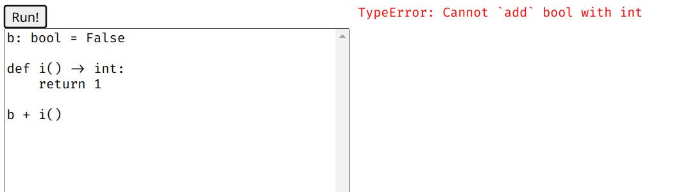
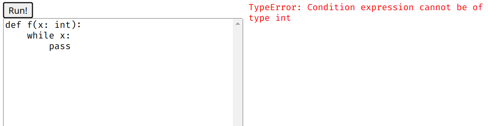
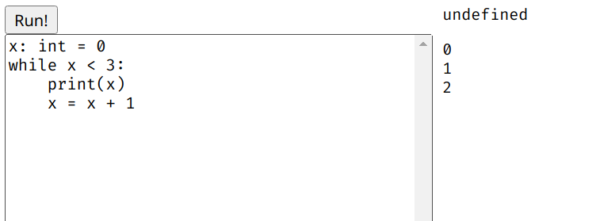
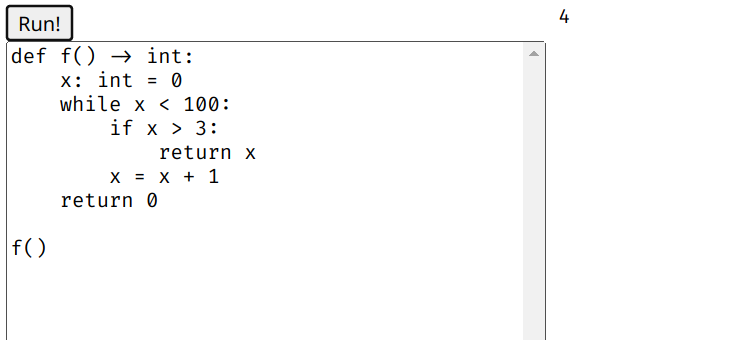
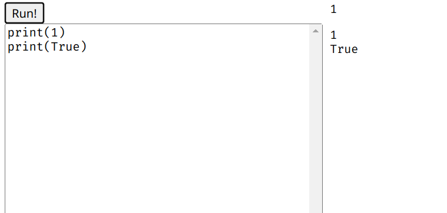
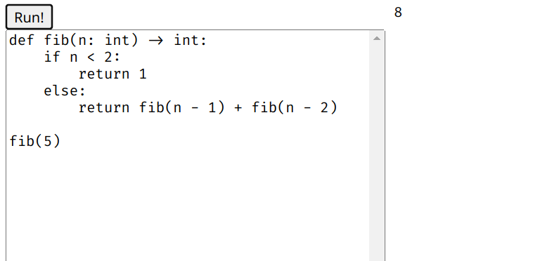
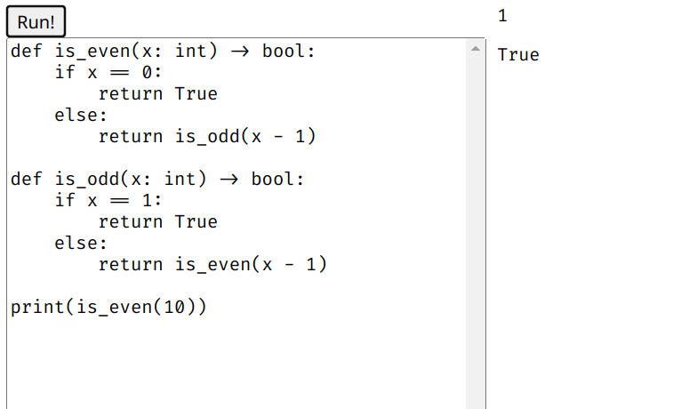

# CSE 231 PA2

Ruochen Wang

## 1. description of the representations

All types are represented as i32 in webassembly. The integers are just
represented straightforwardly as i32. For booleans, I use 1 for True and 0 for
False. For none, I just represent it with 0. The exact value is not relevant
since there's only one possible value of type none.

When printing booleans, first the compiler will choose the right function base
on the type. In the print_bool function, I check if the value is 0 or not. If
it's 0, then print "False", otherwise print "True".
```javascript
case "call": {
  const valStmts = expr.args.flatMap(codeGenExpr);
  let funcname: string;
  if (expr.name === "print") {
    const argtype = expr.args[0].a.typ.tag;
    if (argtype === "func") {
      throw new TypeError("Cannot print a function");
    } else {
      funcname = `print_${argtype}`; // Choose the right print function
    }
  } else {
    funcname = expr.name;
  }
  return valStmts.concat([`(call $${funcname})`]);
}
```

```javscript
console.log(arg === 0 ? "False" : "True");
```

## 2. variables

Program:
```python
glob: int = 0

def func(x: int) -> bool:
    y: bool = False
    if x > 0:
        return y
    else:
        return not y

print(func(glob))
```

**typecheck phase**

The variables are stored in a structure called scope. The scope is an array of
maps that map from identifier names to types. The 0-th element of the scope is
the map for global identifiers. If the scope has more than one element, it means
we are in a function and the 1-st element is the map for the local environment
of the function.

Global variable: when typechecking declarations, we add the variable and its
type to the 0-th element of the scope. (Location in code: `tc.ts:190`)

Function argument: when typechecking a function, we add a new map to the scope,
which is the 1-st element. We then add the argument types to the 1-st element of
the scope. (`tc.ts:224`)

Local variables: after adding the function arguments to the scope, we add the
local variables to the 1-st element of the scope. (`tc.ts:224`)

Also for places that references the variables (`id` expressions and assignment
statements to the variable), I store an `isGlobal` flag with the expression or
statement for the codegen phase. (`tc.ts:33` and `tc.ts:114`)

**codegen phase**

I don't store any information for the variables in the codegen phase apart from
the `isGlobal` flag.

## 3. infinite loop

The program I tested was
```python
while True:
    pass
```
The webpage just freezes.

## 4. screenshots

The first line of the output is the return value of the program. The rest are
the output of print calls.

> A program that reports a type error for adding a number and a boolean where
> one operand is a call expression and the other operand is a variable



> A program that has a type error in a conditional position (the condition part
> of an if or while), where that position is a non-global identifier (function
> parameter or local variable)



> A program with a loop that has multiple iterations, and calls a function on
> each iteration (it can be the same function)



> A program that returns from the body of a loop, and not on the first iteration
> of the loop



> Printing an integer and a boolean



> A recursive function that terminates



> Two mutually-recursive functions that terminate



## 5. type-checking code

In the first example, when we are type checking a binary operator, we first get
the argument types of that operator, then compare the types of the expressions
around the operator with the argument type. If one of the types doesn't match,
there's a type error.

```typescript
export const BINOP_ARGS: { [key: string]: Type[] } = {
  "+": [{ tag: "int" }, { tag: "int" }], // <-- type of the arguments of the + operator
  "-": [{ tag: "int" }, { tag: "int" }],
  "*": [{ tag: "int" }, { tag: "int" }],
  ...
};

// in tcExpr():
case "binop": {
  const argType = BINOP_ARGS[e.op];
  ...
  const leftType = tcExpr(e.left, scope);
  const rightType = tcExpr(e.right, scope);
  const verb = BINOP_VERB[e.op];
  if (!sameType(leftType, argType[0]) || !sameType(rightType, argType[1])) { // <-- typecheck
    const showverb = verb === "compare" ? verb : `\`${verb}\``;
    throw new TypeError(`Cannot ${showverb} ${leftType.tag} with ${rightType.tag}`);
  }
  return retType;
}
```
